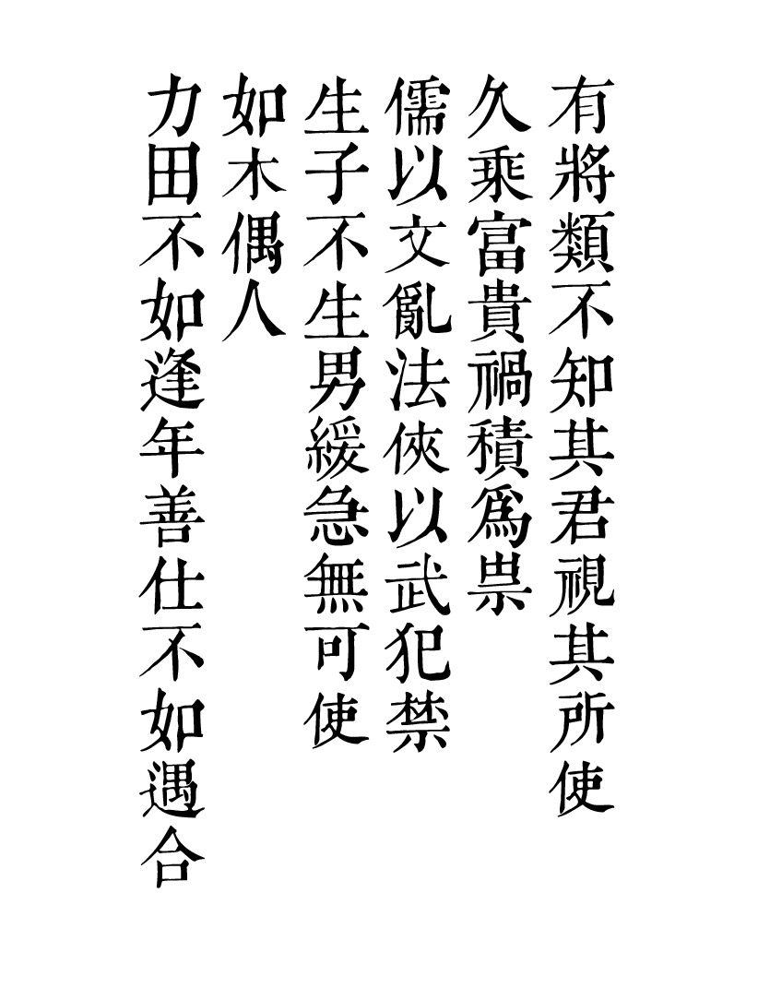
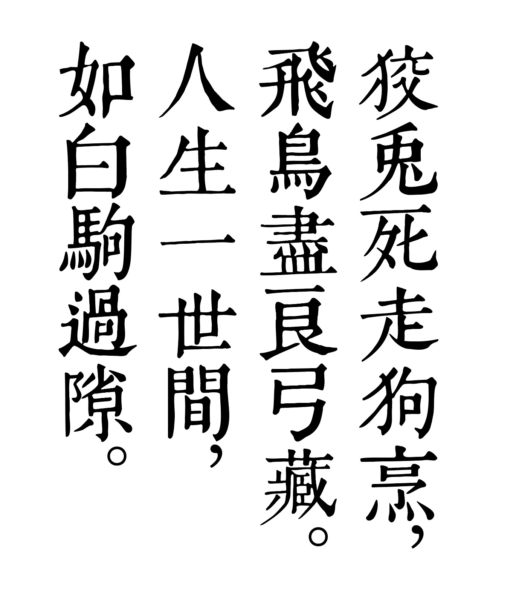

# GDGuFengSong
GD古风标宋体

## GD古风标宋体
不断添加字形中~

    

 

## 有什么特点？
古风宋，尽量保证固体字的意味。
太过工整，略失古意。所以，在可识别的基础上，尽可能保留古籍雕版的意味。

## GD是什么意思？
因为作者的儿子小名叫「狗腚」，所以就随意了一些。

## 联系方式
QQ：139177
Mail：139177@qq.com 
Gmail: yishuihange@gmail.com 
